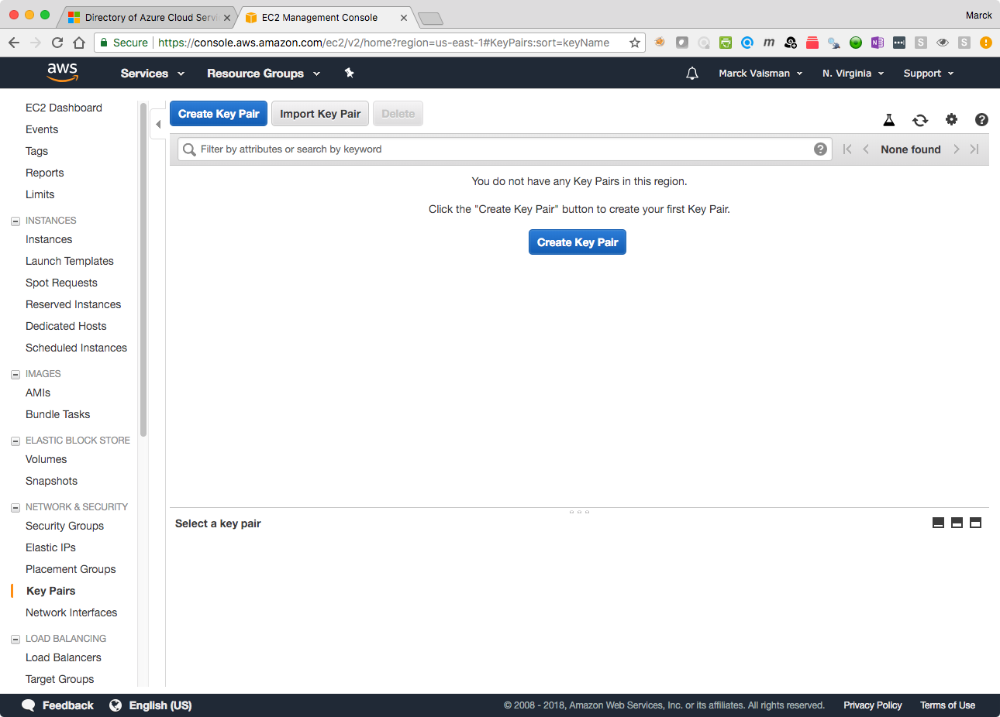
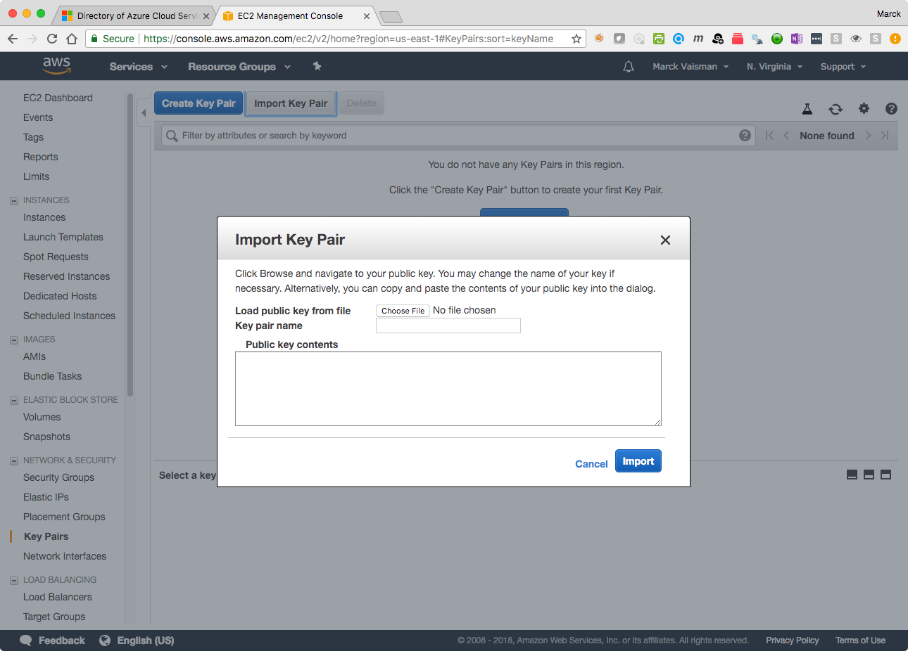
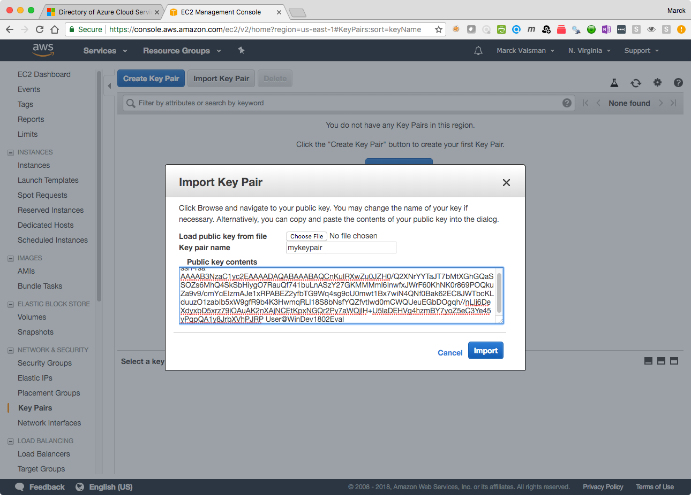
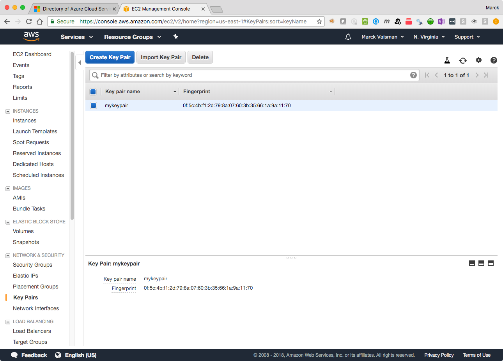
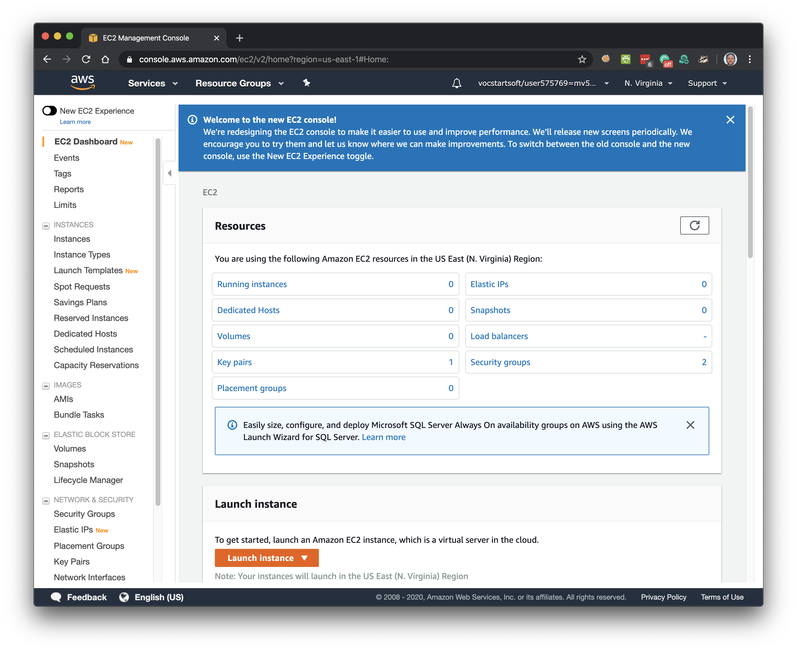
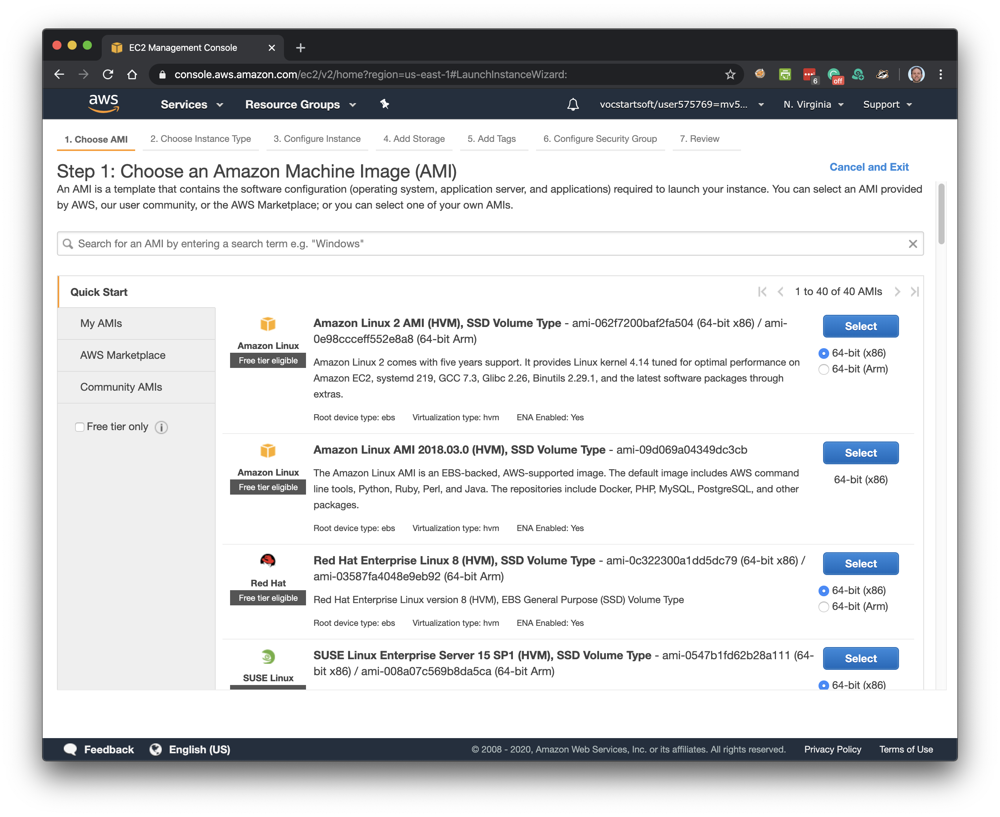
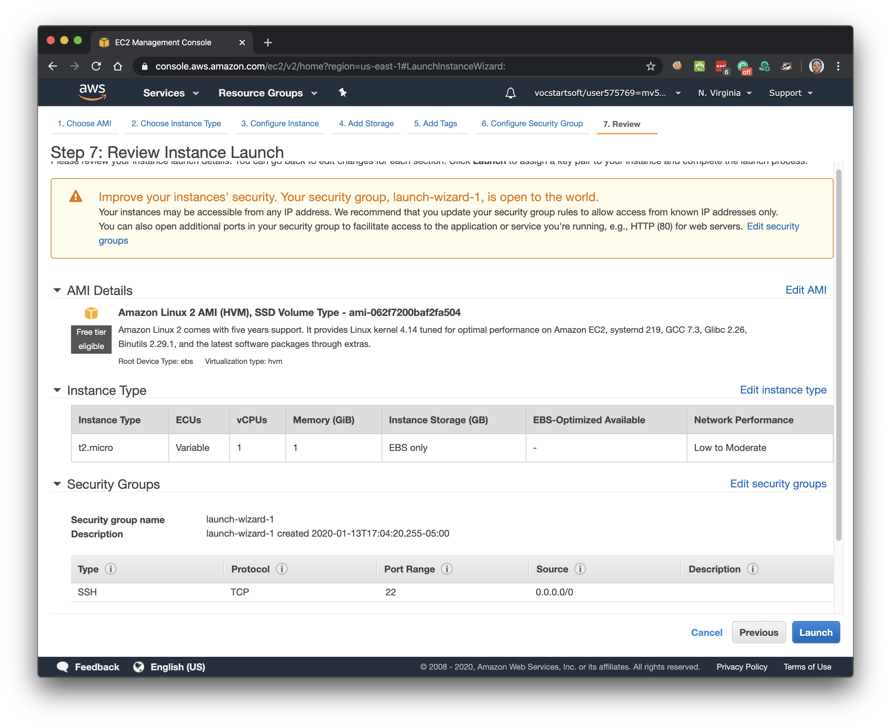

# AWS Setup

Follow these instructions _step-by-step_ to setup your AWS environment. The screenshots may look a bit different than what you are seeing, but the flow is the same.

## Task 1: Accept the Invitation to join the AWS Classroom (the first time)

1. In your student email inbox, you will have an email from _AWS Educate Support_ with the subject _Your AWS Educate Application_. 
1. Open the email.
1. In the fourth paragraph, **right click** where it says _click here_ and **open the link in a private/incognito browser page**
1. Fill in the fields for country (USA), first name, last name, graduation month and year, and your birth month and year. Your school and email address are already populated and you cannot change this.  Click _next_.
1. Scroll down and accept the AWS Educate Terms and Conditions. Click _submit_. You will get a confirmtion page.
1. Check your email again for an email from _AWS Educate Support_ with the subject _Email Verification - AWS Educate Application_.
1. Right click on the confirmation link and open it in a private/incognito browser window
1. Wait for the approval email from _AWS Educate Support_ with the subject _AWS Educate Application Approved_.
1. Right click on _Click here_ and open in a private/incognito window
1. Create a password
1. After you create the password, you'll be logged into AWS Educate
1. Click on _My Classrooms_ at the top
1. You'll see the classroom you've joined, the credit amount you have, and a blue button that says _Go to classroom_. Click on the blue button.
1. Click Continue on the _Confirm_ notice
1. Accept the _Vocareum_ terms and conditions
1. In the _Welcome to your AWS Educate Account_ page, click on the _AWS Console_ button towards the right
1. You have now logged into the AWS Console


### Logging into the AWS Console at a later time

To access the AWS Console in the future, you don't need to do all the steps in the previous secion.

1. Open a private/incognito browser window
1. Go to [https://aws.amazon.com/education/awseducate/]() and click on _Sign in to AWS Educate_
1. Login with your student email and the password you created  
1. Click on _My Classrooms_ at the top
1. Click on the blue _Go to classroom_ button
1. Click Continue on the _Confirm_ notice
1. In the _Welcome to your AWS Educate Account_ page, click on the _AWS Console_ button towards the right
1. You have now logged into the AWS Console


## Task 2: Upload your Public key to AWS (do this one time only)

1. Login to your AWS Console if you are not already logged in
1. Go to the EC2 Dashboard. You can get here by clicking on **Services** in the top left and choosing **EC2** under the **Compute** heading
1. Click on **Key Pairs** on the left hand side of the EC2 console. If you don't see it, scroll down the left side panel until you see the **NETWORK & SECURITY** heading, and you will see the following:

	

1. Click on **Import Key Pair** at the top of the screen and the "Import Key Pair" dialog will show:

	

1. In the **Key pair name** box, enter `mykeypair` or a name that is meaningful to you. It can be anything, just make sure you know what it is.
1. In the **Public Key Contents** box, paste the contents of the **public key** that you got before.

	

1. Click **Import** and you will see your key in the console.

	

You will use your key to connect to AWS resources later.


## Task 3: Create a Security Group (do this one time only)

Before we launch our first AWS EC2 instance, we will setup a _Security Group_ in the AWS Console. Each account comes with a default security group, but we will create a specific one that we will use to connect to our EC2 instance via `ssh`, which means it will open up port 22 on your instance.

1. Log on to your [AWS Console](https://console.aws.amazon.com/) if you are not already logged in
1. Go to the EC2 Dashboard. You can get here by clicking on **Services** in the top left and choosing **EC2** under the **Compute** heading
1. Click on **Security Groups** on the left hand side of the EC2 console. If you don't see it, scroll down the left side panel until you see the **NETWORK & SECURITY** heading, and you will see the following:

	

1. Click on **Create Security Group**. 
	* Enter a name for your security group (you can call it whatever you want; I called it **open-22** to make it easy.) 
	* Enter a description for your group
	* Leave the VPC value unchanged (your number will be different than the one shown below.)
	* Click on **Add Rule** towards the bottom
	* Select **SSH** from **Type**
	* Select **Anywhere** from **Source**
	* Click **Create**

	

1. You have just created a security group that opens up port 22 and allows you to connect from anywhere, and you should see it in the Security Groups console (again, the group id will be different for each of you). You will use this group that you just created when you launch an instance for this assignment

	


## Task 4: Launch your first Linux instance/virtual machine on AWS

This is a step-by-step guide on how to launch an instance.

1. From the **EC2 Dashboard**, click on the **Launch Instance** button

	

2. _Step 1: Choose an Amazon Machine Image:_ 

	* Click on **Quick Start** on the left hand side and select the first image **Amazon Linux 2 AMI**

	


1. _Step 2: Choose an Instance Type:_ Select the **t2.micro** instance type (this one is eligible for the free tier), and click **Next: Configure Instance Details**

	

1. _Step 3: Configure Instance Details:_ Nothing to do here, click **Next: Add Storage**

	

1. _Step 4: Add Storage:_ Nothing to do here, click **Next: Add Tags**

	

1. _Step 5: Add Tags:_ Nothing to do here, click **Next: Configure Security Group**

	

1. _Step 6: Configure Security Group:_ Click on **Select an existing security group** radio button, and then select the **open-22 (or whichever name you gave it)** Security Group that you created eariler, click **Review and Launch**

	

1. _Step 7: Review Instance Launch:_ You will see a warning about your security group being open to the world. You can ignore it, we know. Make sure that the AMI, the Instance Type, and the Security Group is what you wanted. Click **Launch**

	

1. _Select an existing key pair or create a new key pair:_ In this screen select **choose an existing keypair** from the dropdown, and make sure you select the keypair that you uploaded to AWS, otherwise you will not be able to connect to your machine. Click **Launch Instances**

	

1. _Launch Status:_ Click **View Instances** to go back to the EC2 Instances page

	

1. In the EC2 Console, you will see the status of your instance. Sometimes the instances are launched immediately, but sometimes you have to wait. While waiting, you will see the Instance Status showing a yellow dot with "pending", otherwise it will be a green dot with "running"

1. When the instance is in "running" state, it is ready to be used!

## Task 5: Connect to the remote server using Secure Shell `ssh`

We will be using the terminal with Secure Shell to connect to our remote instance. 

* Open a terminal on your laptop. If you have one already open, type `cd ~` to navigate back to your home directory
* Go to the EC2 Instances page (click on EC2, then on Instances on the left)
* Click on your running instance such that the select box is blue
* Click in the **Description** tab in the bottom if not already selected
* Hover with your mouse over the **Public DNS** text, and you will see a "Copy to Clipboard" icon to the right. Click on that to copy your instances DNS address.


* In the terminal, type `cd ~` to make sure you are in your home directory
* Type `ssh ec2-user@` and paste your DNS address
* If everything is configured correctly, the first time you connect to a host that you've never connected to, you will see something like this:

```
The authenticity of host 'ec2-54-163-133-120.compute-1.amazonaws.com 
(54.163.133.120)'can't be established.
ECDSA key fingerprint is SHA256:TeYrgHLkYHvD/zcp23bO3wozsLMyPSiSn+edPPo88zE.
Are you sure you want to continue connecting (yes/no)?
```
Note: your values for DNS, IP address and fingerprint will be different

* Enter `yes` and press enter. You will only need to enter yes once.
* If you are successful, you will see something like this:

```
The authenticity of host 'ec2-54-163-133-120.compute-1.amazonaws.com (54.163.133.120)' 
can't be established.
ECDSA key fingerprint is SHA256:TeYrgHLkYHvD/zcp23bO3wozsLMyPSiSn+edPPo88zE.
Are you sure you want to continue connecting (yes/no)? yes
Warning: Permanently added 'ec2-54-163-133-120.compute-1.amazonaws.com,54.163.133.120' (ECDSA) to the list of known hosts.
Last login: Thu Jan 25 01:41:17 2018 from pool-108-45-73-252.washdc.fios.verizon.net

       __|  __|_  )
       _|  (     /   Amazon Linux 2 AMI
      ___|\___|___|

https://aws.amazon.com/amazon-linux-2/
[ec2-user@ip-172-31-59-103 ~]$
```
**Congratulations, you have successfully connected to your remote instance!**

## Task 6: Stop or terminate your virtual machine

There are two concepts you need to understand:

* Stopping a VM is like turning the machine off. The current state is saved and you can turn it on again later.
* Terminating a VM deletes the VM and all associated resources. This cannot be undone.

### To stop/pause a VM

1. Go to the EC2 Dashboard. You can get here by clicking on **Services** in the top left and choosing **EC2** under the **Compute** heading
2. Click on the Instance ID of the running machine
3. Click on the _Instance State_ button on the top right
4. Choose _Stop Instance_

### To stop/pause a VM

1. Go to the EC2 Dashboard. You can get here by clicking on **Services** in the top left and choosing **EC2** under the **Compute** heading
2. Click on the Instance ID of the running machine
3. Click on the _Instance State_ button on the top right
4. Choose _Terminate Instance_


